# 🎵 Ninaada Music

**Resonating Beyond Listening**

A premium, high-performance Indian music streaming application available across multiple platforms — Flutter (Android), React Native (Android), and Next.js (Web).

## 📱 Platforms

| Platform | Directory | Tech Stack |
|----------|-----------|------------|
| **Flutter App** | `ninaada_flutter/` | Flutter, Dart, Riverpod, just_audio |
| **React Native App** | `mobile-app/` | React Native, react-native-track-player |
| **Web App** | `frontend-web/` | Next.js, React, TypeScript, Tailwind CSS |

## 📸 Screenshots

<details>
<summary><strong>🚀 Onboarding</strong></summary>
<br>
<p align="center">
  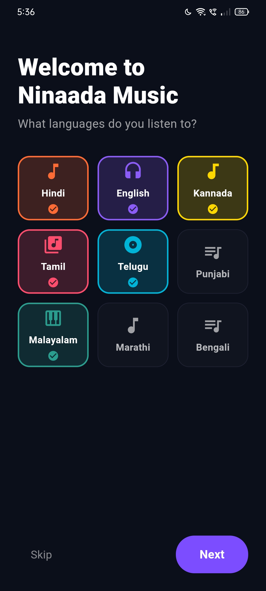
  &nbsp;&nbsp;
  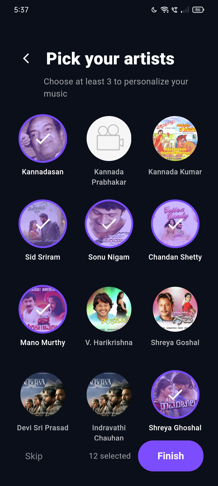
</p>
</details>

<details>
<summary><strong>🏠 Home Screen</strong></summary>
<br>
<p align="center">
  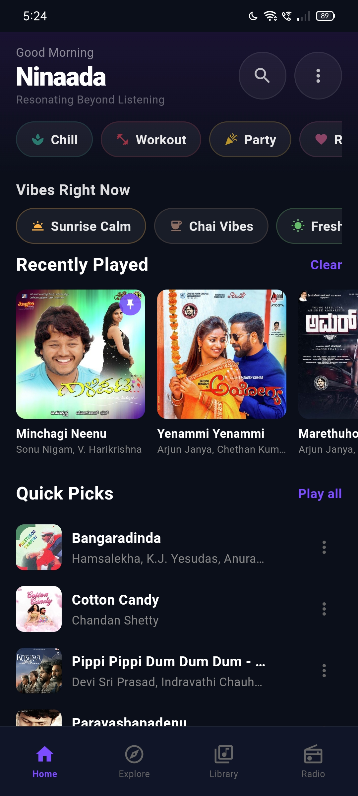
  &nbsp;&nbsp;
  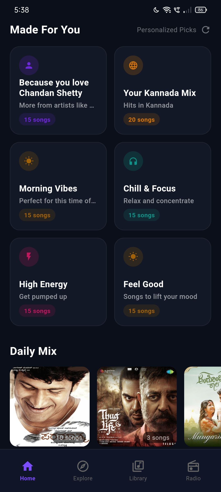
  &nbsp;&nbsp;
  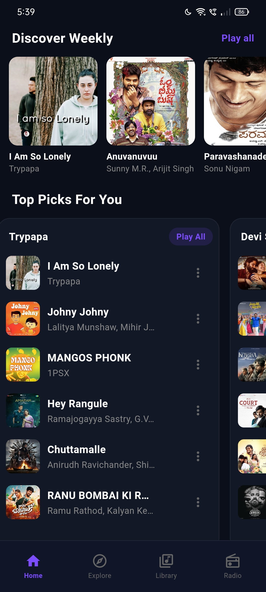
</p>
<p align="center">
  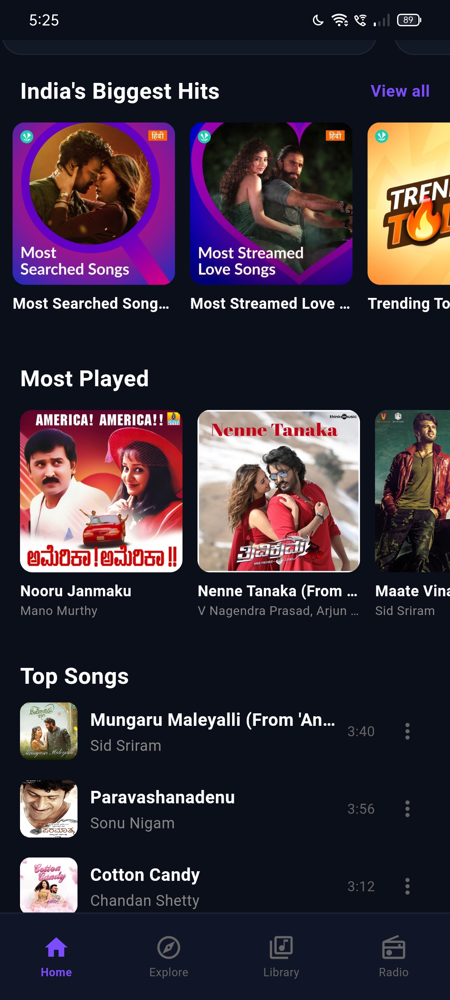
  &nbsp;&nbsp;
  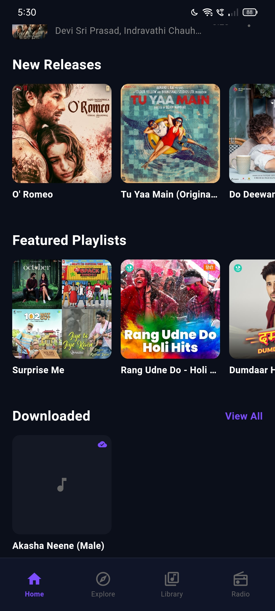
</p>
</details>

<details>
<summary><strong>🔍 Search</strong></summary>
<br>
<p align="center">
  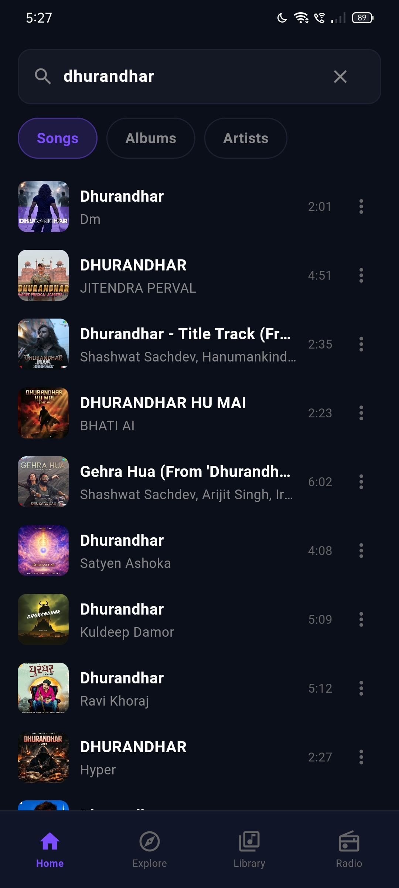
  &nbsp;&nbsp;
  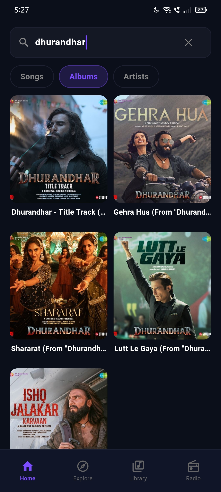
  &nbsp;&nbsp;
  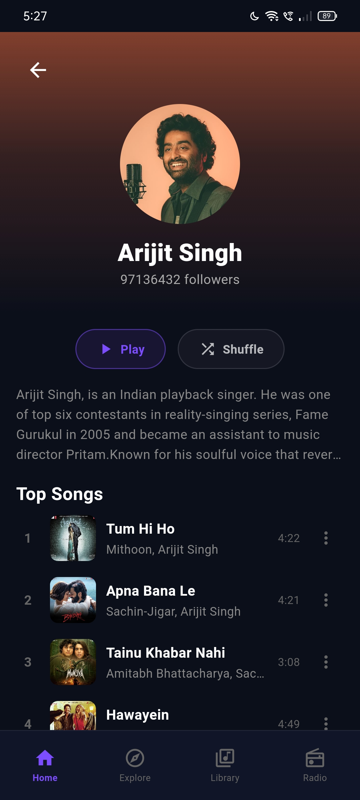
</p>
</details>

<details>
<summary><strong>📚 Library, Radio & Explore</strong></summary>
<br>
<p align="center">
  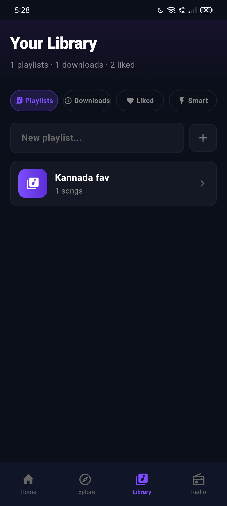
  &nbsp;&nbsp;
  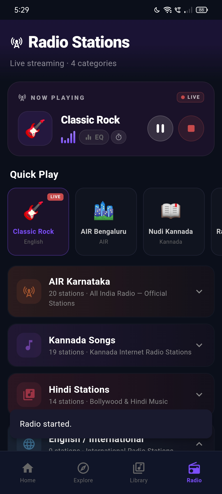
  &nbsp;&nbsp;
  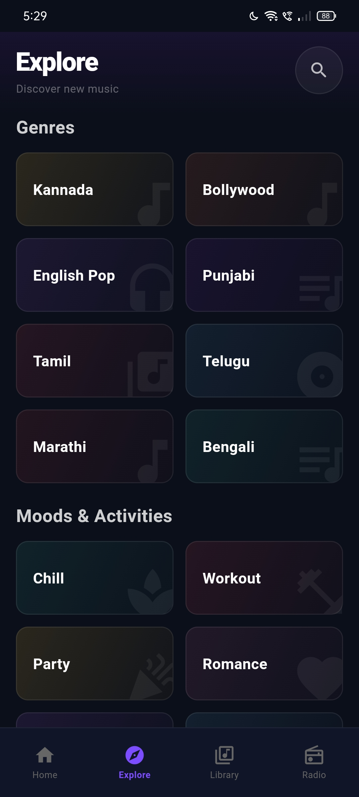
</p>
</details>

<details>
<summary><strong>🎧 Now Playing & Controls</strong></summary>
<br>
<p align="center">
  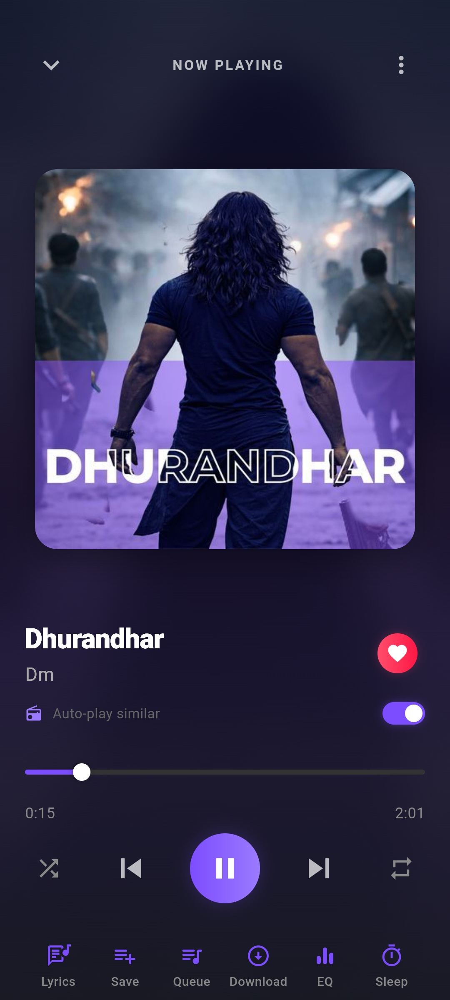
  &nbsp;&nbsp;
  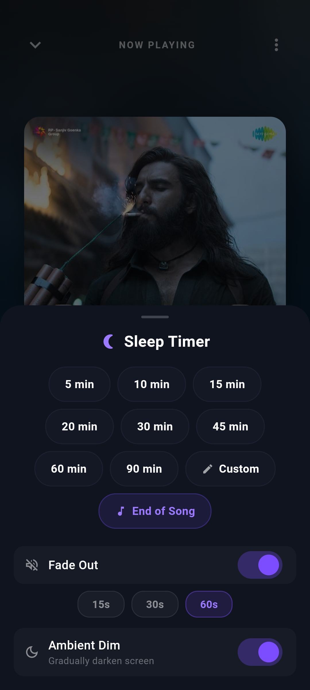
  &nbsp;&nbsp;
  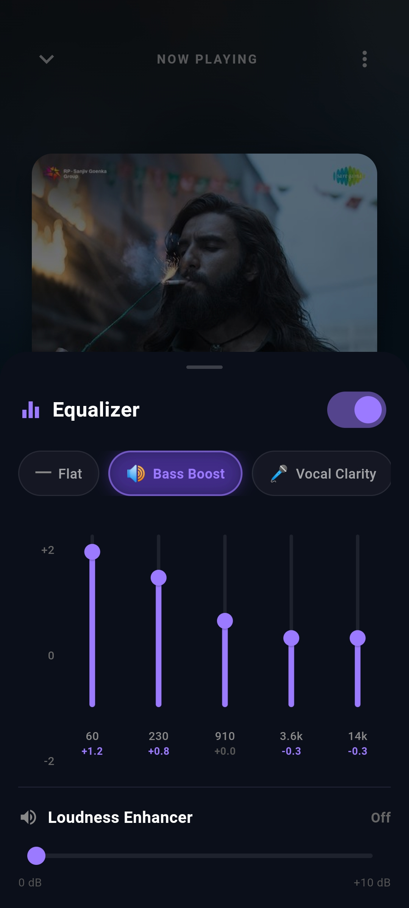
</p>
<p align="center">
  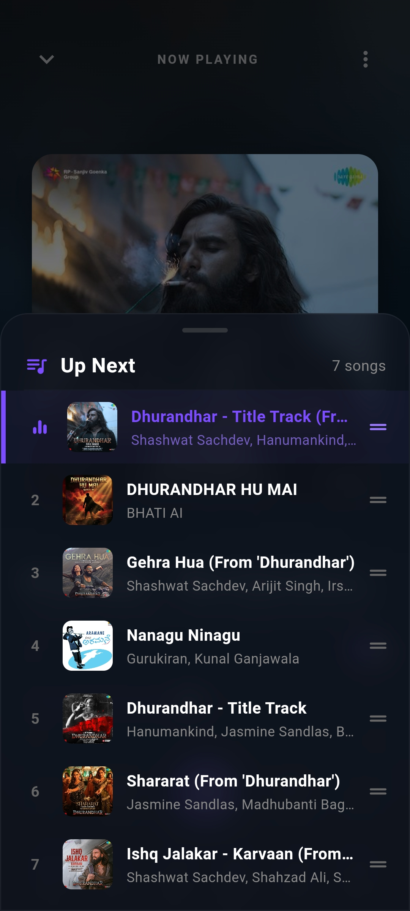
  &nbsp;&nbsp;
  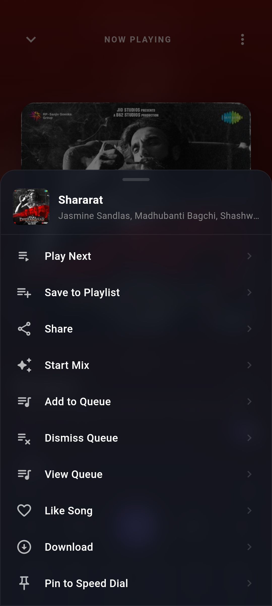
  &nbsp;&nbsp;
  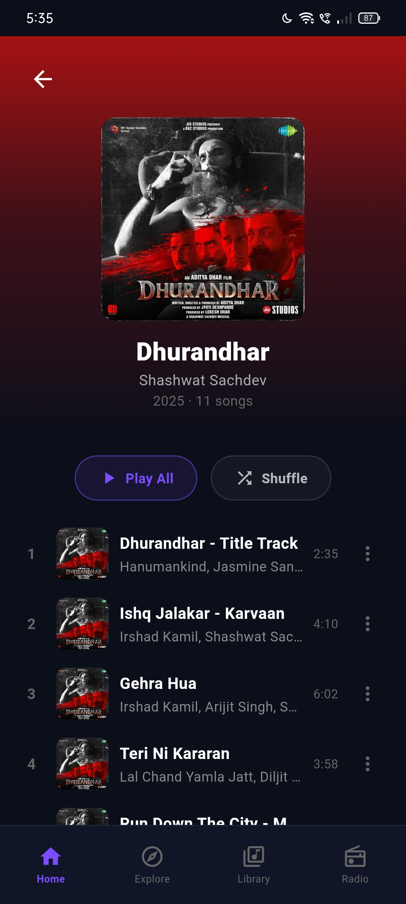
</p>
</details>

## ✨ Key Features

- 🎧 **Gapless Playback** — Seamless track-to-track transitions with pre-buffering
- 🎚️ **5-Band Equalizer** — Hardware-accelerated DSP with Bass Boost and Loudness Enhancer
- 📻 **Live Radio** — 30+ curated stations across Indian languages
- 🧠 **Smart Recommendations** — Behavior-aware engine that learns your taste
- 📝 **Synced Lyrics** — Binary search-based LRC parser with sub-millisecond accuracy
- ⬇️ **Offline Mode** — Multi-threaded download manager with flexible bitrate control
- 😴 **Sleep Timer & Alarm** — Schedule playback to stop or wake you up
- 🎤 **Voice Commands** — Hands-free music control
- 🎨 **Dynamic Theming** — UI colors adapt to album artwork in real-time

## 🚀 Getting Started

### Flutter App
```bash
cd ninaada_flutter
flutter pub get
flutter run
```

### React Native App
```bash
cd mobile-app
npm install
npx react-native run-android
```

### Web App
```bash
cd frontend-web
npm install
npm run dev
```

## 🏗️ Architecture

> 📖 For a detailed system architecture breakdown with diagrams, see [ARCHITECTURE.md](ARCHITECTURE.md)

The Flutter app follows a **Unidirectional Data Flow** pattern powered by Riverpod, with a layered engine stack:

- **Audio Handler** — Bridges `just_audio` with `audio_service` for background playback
- **Recommendation Engine** — Intelligent song ranking based on user taste profile
- **PreBuffer Engine** — Anticipatory audio loading at 80% track completion
- **MediaTheme Engine** — Real-time glassmorphic UI color shifting from artwork

## 👤 Author

**Abdulappa M**

## 📄 License

This project is licensed under the GPL-3.0 License — see the [LICENSE](LICENSE) file for details.

---

## ⚠️ Disclaimer

This project is for **educational and personal use only**. It is not affiliated with, endorsed by, or associated with any official music streaming service or company. All product names, trademarks, and registered trademarks are the property of their respective owners. The music content accessed through this application is streamed via third-party services and is not hosted or distributed by this project.
